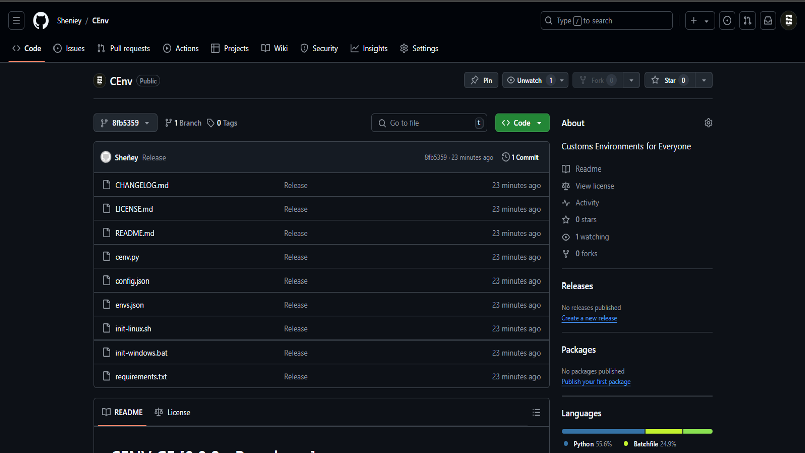

# CENV CE [0.0.0 - Prerelease]
> **By:** Sheñey [José Daniel]
>
> **License:** GPLv3
>
> **Update:** 02/12/2024

---

[About CEnv](#cenv "Goto |About This > CEnv|") | [**About Me**](#me "Goto |About This > Me|") | [Requitements](#system-requitements "Goto |Important Notes > System Requitements|") | [License](#license "Goto |Important Notes > License|" ) | [**Download**](#-download "Goto |Download|")

---

## [*] About This:
#### CEnv:
***CEnv CE*** [Comiunity Edition] es una herramienta (Script) que crea **Entornos** de Desarrollo y Programacón *Customs*/*Predefinidos* por el usuario con una interfas interactiva multilingüe [english, español]...

Si deseas una Edición más Light o Pro...
<fieldset>
    <legend>CEnv LE</legend>
    
<b><i>CEnv LE</i></b> [Light Edition] es una Edición Reducida/Ligth de <i>CEnv CE</i> al tener una interfas estatica, ideal para <i>Optimizar Recursos</i> en el <b>Hardware</b>.

</fieldset>
 
<fieldset>
    <legend>CEnv PE</legend>
    
<b><i>CEnv PE</i></b> [Professional Edition] es una Edición Profesional/Pro de <i>CEnv CE</i>, ya que cuenta con una interfas <b><i>GUI</i></b> y una lista de <i>Entornos</i> Predefinidos enfocados para el uso en <b>Proyectos Profesionales</b>.

    <blockquote>
        
<b>[+] Advice:</b> Es Posible que en un futuro está <i>Edición</i> deje de ser <b>Gratis</b>.
 
    </nlockquote>
</fieldset>
 

#### Me:
**I am *Sheñey*** un chico Mexicano de 14 años apasionado por las *Ciencias Computacionales*; si te gustaria apoyarme, pues estas de suerte *Creo...:
Puedes Aportar tu *Granito de Arena* de las siguientes maneras:
1. Puedes [comprarme un Cafesito](https://www.paypal.com "Support me in PayPal") :coffee: por $2 :dollar: USD...
2. Contribuye con tus conocimientos al Codigo para añadir más funciones e idiomas nuevos...
3. Me haría mucha ilusión que distribuyeras y/o esparcieras CEnv. Solo di que es mío :smiley:...
4. Además, ¿podrias apoyar mí [Canal de YouTube](htttps://www.youtube.com/@SheñeyBy2010 "Follow in YouTube |@SheñeyBy2010|") o [Repositorio de GitHub](https://www.github.com/Sheniey/CEnv "Follow in GitHub |Sheñey|")?

---

## [*] Important Notes:
#### System Requitements:
<table>
    <thead>
        <tr>
            <th>Attribute</th>
            <th>Minimum</th>
            <th>Recommended</th>
            <th>Model</th>
        </tr>
    </thead>
    <tbody>
        <tr>
            <td>Memory</td>
            <td>64 MiB</td>
            <td>128 MiB</td>
            <td>DDR2 DIMM SDRAM</td>
        </tr>
        <tr>
            <td>Storage</td>
            <td>16 KiB</td>
            <td>32 KiB</td>
            <td>HDD Sata III</td>
        </tr>
        <tr>
            <td>Arch</td>
            <td>x32</td>
            <td>x64</td>
            <td>x86 | ARM</td>
        </tr>
        <tr>
            <td>CPU</td>
            <td>2 Cores | 1.2 GB Hz</td>
            <td>4 Cores | 3.6 GB Hz</td>
            <td>Intel Core | AMD Ryzen</td>
        </tr>
        <tr>
            <td>GPU</td>
            <td>DirectX 10 | OpenGl 3</td>
            <td>DirectX 12 | OpenGL 4.5</td>
            <td>HD Graphics 630</td>
        </tr>
        <tr>
            <td>OS :computer:</td>
            <td>Windows 7 | OSx 10.9</td>
            <td>Arch | Ubuntu | Debian</td>
            <td>Linux Kernel</td>
        </tr>
    </tbody>
</table>

> ***CEnv*** Also uses ***Python** Modules*: [rich](https://rich.readthedocs.io/en/stable/introduction.html "Install Python3-Rich") & [curses](https://docs.python.org/3/howto/curses.html "Install Python3-Curses")...

#### License:
Con el objetivo de que ***CEnv*** pertenesca a algun **Administrador de Paquetes** cómo *Debian* (apt), *Arch* (pacman), Ubuntu (idk) o Windows (Chocollatey), he decidido adoptar una ***Politica de Uso*** parecida, si no igual, a la *Licencia **GPLv3*** del *Open Source System* **GNU/Linux**.

#### Documentation:
The Documentation's in the file [DOCS.md](./DOCS.md "Goto the DOCUMENTATION"), here is the Documentation :book: and in the file [CHANGELOG.md](./CHANGELOG.md "Goto the CHANGELOG") is the log of all Updates about ***CEnv CE***.

---

## [*] Download:
> [ZIP Download](https://github.com/Sheniey/CEnv/archive/8fb5359b4e252314258e6650cf210a9de4c52f09.zip "Download the GitHub Reprository") / [ZIP Method](#zip-method "Goto |Download > ZIP Method|") / [Git Method](#git-method "Goto |Download > Git Method|")
#### ZIP Method:

#### Git Method:

